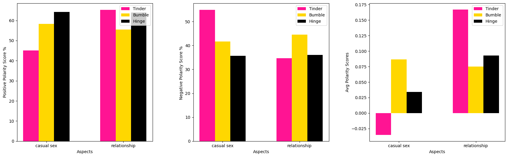

# __What do you like in dating apps__

In the last years, __dating apps__ have become more and more popular, and have
caught the attention of researchers studying the interplay between new __media technologies__ and __society__. 

Studies have analyzed the motives driving people to use these apps, finding them ranging from __casual sex__ to simply __killing time__, as well as involving __romantic__ pursuits and other kinds of affiliation and information.  Moreover, __gender__ differences in app uses seem to be prominent, with men primarily pursuing hook-up sex, travelling and relationships, and women more prone to seek friendship and self-validation. The aim of this project is to exploit the descriptive power of __aspect-based__ sentiment analysis to try to automatically detect a polarity (and possibly an opinion) for these social impacting aspects. A complete description of the project is available in this [report](https://github.com/aleceress/datingapp_sentiment/blob/master/report.pdf).

## __Models__

Three different models were conceived for this purpose:

- A __rule-based/embeddings__ model, whose results can be visualized in [syntax_lexicon.ipynb](https://github.com/aleceress/datingapp_sentiment/blob/master/syntax_lexicon.ipynb)
- A __TF-IDF/PMI__ model ([pmi_tdfidf.ipynb](https://github.com/aleceress/datingapp_sentiment/blob/master/pmi_tfidf.ipynb))
- A __BM25/BERT__ based model ([bm25_bert.ipynb](https://github.com/aleceress/datingapp_sentiment/blob/master/bm25_bert.ipynb))

The models were evaluated on two datasets containing reviews about Tinder, Bumble and Hinge.




## __Running__

To run all the experiments, type the following commands:
```
virtualenv venv 
source venv/bin/activate
pip install -U pip setuptools wheel
pip install -U spacy
python -m spacy download en_core_web_sm
pip install -r requirements.txt
```

You also need to download the two datasets from [here](https://www.kaggle.com/datasets/shivkumarganesh/tinder-google-play-store-review) and [here](https://www.kaggle.com/datasets/sidharthkriplani/datingappreviews) and place them in a `data/` folder. Before executing code in syntax_lexicon.ipynb, run:

```
python3 preprocess_spacy.py <app [tinder, bumble, hinge]>
```

This will create a set of spacy-preprocessed reviews for part-of-speech tagging, stored in a `data/<app>_spacy` folder.